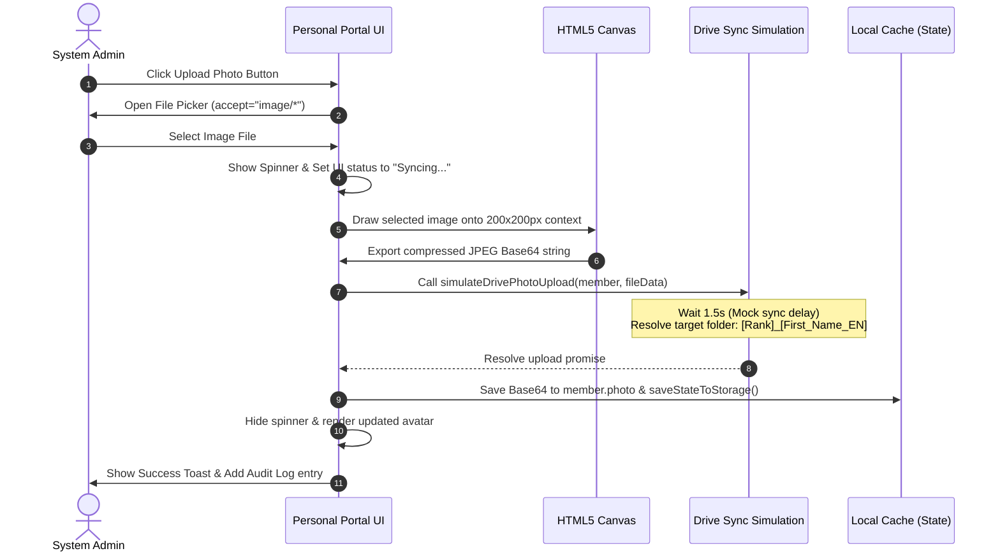

# Design Specification: Personal Profile Photo Capabilities

**Date:** 2026-07-15  
**Status:** Approved  
**Scope:** Client-side Profile Photo Upload, Canvas-based Image Compression, Simulated Google Drive Sync to Personal Folders, and Role-based Display.

---

## 🌟 Overview

This document specifies the technical design for adding individual photo support to the **Personal Profile block** in the AeroCheck Crew Training Dashboard SPA. It defines the upload flow, browser-side image scaling and compression to keep cache usage low, role-based edit controls, and the mock Google Drive folder sync integration.

---

## 🎯 Requirements

1. **Aesthetic Placement:**
   * Display the crew member's photo at the top of the **Personal Profile** card.
   * Centered horizontally (aligning - middle).
   * Show a modern circular profile picture (120x120px) with a subtle border and shadow.
   * If no photo exists, render a clean fallback initials letter avatar or generic silhouette.

2. **Access Control:**
   * **Only Admin** users (`role === 'ADMIN'`) can add, change, or remove photos.
   * Other roles (`CREW`, `INSTRUCTOR`, `OFFICE`) can view the photo but must not see any upload/edit interface.

3. **Storage & Persistence:**
   * Stored directly in the crew member's object under the `photo` property as a compressed JPEG Base64 string.
   * Automatically persists inside `localStorage` keys (`aerocheck_flight_crew` / `aerocheck_cabin_crew`) on change.
   * Included in JSON backup exports and sync payload.

4. **Image Compression & Canvas Processing:**
   * User-uploaded files must be scaled down in-browser to a maximum of **200x200 pixels** and converted to `image/jpeg` with `0.8` quality compression.
   * This limits storage size per photo to **~8KB to 15KB**, preventing `localStorage` quota issues.

5. **Google Drive Sync Simulation:**
   * When an admin uploads a photo, a mock Google Drive synchronization function is triggered.
   * Displays a visual spinner loader inside the avatar container for 1.5 seconds.
   * Once complete, saves the photo locally, shows a toast success message, and registers an audit log entry.
   * The mock upload simulation targets the crew member's individual folder on Google Drive, named using the format: `[Rank]_[First_Name_EN]` (e.g. `КПС_Avezov` or `БП-РА_Aleksa`).

---

## 🏗️ Architecture & Component Flow

### 1. Upload & Canvas Resize Sequence


---

## 🛠️ Proposed Changes

### 1. Core Codebase

#### [MODIFY] [drive_sync.js](file:///d:/WIBECODING/TRAINING%20LEVEL/execution/drive_sync.js)
* Add a mock upload function `simulateDrivePhotoUpload(member, fileData, callback)`:
  * Calculates the destination folder path: `Google Drive / Crew Documents / [Rank]_[First_Name_EN] / photo.jpg` (using `member.Rank` and the first word of `member.Full_Name_EN`).
  * Simulates a 1.5-second network delay using `setTimeout`.
  * Triggers a callback on completion.

#### [MODIFY] [app.js](file:///d:/WIBECODING/TRAINING%20LEVEL/js/app.js)
* **CSS Additions (to support overlay button styling inline or via stylesheets):**
  * Define classes for the profile avatar wrapper, avatar image, upload overlay, and loading spinner in JS/CSS.
* **Update `renderPersonalPortal()`:**
  * Add the profile photo markup to the top of `#portal-profile-details` (centered).
  * Build the HTML container structure:
    ```html
    <div class="profile-avatar-container" style="display: flex; flex-direction: column; align-items: center; justify-content: center; margin-bottom: var(--spacing-4); width: 100%;">
       <!-- Avatar circle -->
       <div class="avatar-circle-wrapper" style="position: relative; width: 120px; height: 120px; border-radius: 50%; border: 3px solid var(--border-color); background: var(--bg-surface-alt); display: flex; align-items: center; justify-content: center; overflow: hidden; box-shadow: var(--shadow-md);">
          <!-- Spinner overlay -->
          <div id="avatar-spinner" style="display: none; position: absolute; inset: 0; background: rgba(0,0,0,0.5); z-index: 10; display: none; align-items: center; justify-content: center; color: white;">
             <i data-lucide="loader-2" class="spin" style="width: 24px; height: 24px;"></i>
          </div>
          <!-- Image or Placeholder -->
          
          <div id="avatar-placeholder" style="font-size: 36px; font-weight: 700; color: var(--text-tertiary); font-family: var(--font-display); text-transform: uppercase;">...</div>
          <!-- Admin Edit Overlay -->
          <button id="btn-upload-photo" style="display: none; position: absolute; bottom: 0; left: 0; right: 0; height: 32px; background: rgba(0, 0, 0, 0.6); border: none; border-radius: 0; color: white; display: flex; align-items: center; justify-content: center; cursor: pointer; opacity: 0; transition: opacity 0.2s;" title="Upload Photo">
             <i data-lucide="camera" style="width: 16px; height: 16px;"></i>
          </button>
       </div>
       <!-- Hidden file input -->
       <input type="file" id="photo-file-input" accept="image/*" style="display: none;" />
    </div>
    ```
  * Resolve and render the initials if no `photo` exists (e.g., first letters of name).
  * If `STATE.currentUser.role === ROLES.ADMIN`, render the photo edit button/overlay and add hover trigger styles.
  * Wire up click listeners:
    * Click on `#btn-upload-photo` triggers `#photo-file-input` click event.
    * `#photo-file-input` `change` handler checks if a file is selected:
      * Read selected image with `FileReader`.
      * Create an `Image` object and load it.
      * Draw the image on a `200x200` `<canvas>` element (using `drawImage` to crop/fit square-aspect ratio nicely).
      * Extract base64 JPEG data: `canvas.toDataURL('image/jpeg', 0.8)`.
      * Show spinner.
      * Invoke `simulateDrivePhotoUpload`.
      * Update `member.photo = base64Data`.
      * Log audit entry: `"MANUAL_EDIT"` details: `[{ field: 'photo', oldValue: 'n/a', newValue: 'Uploaded profile photo' }]`.
      * Save state via `saveStateToStorage()`.
      * Hide spinner, display photo, show Toast.
* **Update Translation Strings:**
  * Add labels for upload buttons or toast messages in the UA/EN dictionary inside `js/app.js` (e.g., `toast_photo_success`).

---

## 🧪 Verification Plan

### Automated/Code Verification
* Check that `saveStateToStorage` preserves the `photo` field in `localStorage`.
* Confirm image resizing logic scales high-res images down correctly.

### Manual Verification
1. **Admin Experience (Upload & Persistence):**
   * Log in as `admin@ukr-helicopters.ua`.
   * Go to "Flight Crew" tab, click on "Avezov Rustam" to view their personal portal.
   * Observe the avatar placeholder showing the initials "AR".
   * Hover over the avatar and click the edit overlay (camera icon).
   * Choose an image file from the disk.
   * Verify:
     * A spinner appears.
     * After 1.5 seconds, the spinner disappears, a success toast pops up, and the photo is shown.
     * Refresh the page. Confirm the photo remains loaded.
     * Check the web console and verify the log output:
       `[Google Drive Sync] Photo uploaded to folder: "Google Drive / Crew Documents / КПС_Avezov / photo.jpg"`.
2. **Crew Experience (Read-Only):**
   * Log in as `office@ukr-helicopters.ua` or log in as a crew member.
   * Access the personal portal.
   * Verify the photo uploaded by the admin is displayed correctly.
   * Verify that the camera/edit overlay button is hidden and there is no way to upload files.
